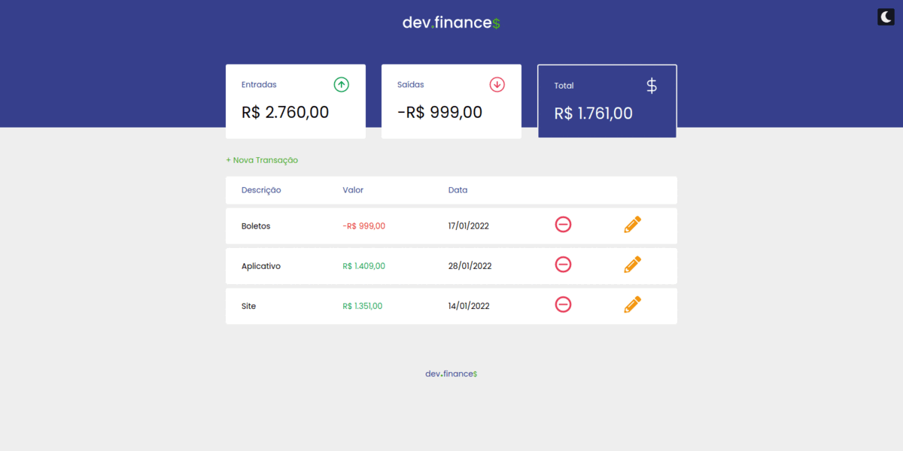
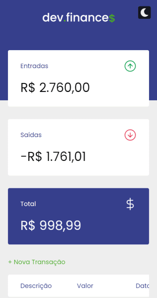

<h1>Dev.Finance$ </h1>

- **About:** Control your finances! User can add, edit or delete a profit/expense and generate balance. Also with dark mode!
- Tech stack:  
- **[Use it now](https://gugamacedo.github.io/dev-finances/)**
 
----
### Desktop

----
### Mobile

